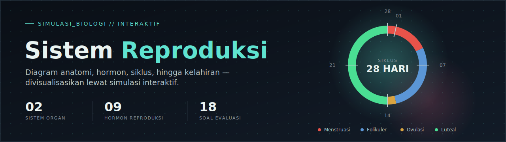

# 🧬 Sistem Reproduksi

**Simulasi & visualisasi interaktif sistem reproduksi manusia** — materi belajar biologi yang dikemas lewat diagram, simulasi, dan kuis, semuanya jalan dari satu file HTML tanpa perlu instalasi apa pun.

---

## ✨ Fitur Utama

- **Diagram Anatomi Interaktif** — organ reproduksi pria & wanita, masing-masing tersedia dalam tampilan tampak depan dan tampak samping (sagital)
- **Spermatogenesis & Oogenesis** — proses pembentukan sel kelamin di kedua sistem
- **Hormon & Pubertas** — sumbu hipotalamus-hipofisis-gonad (HPG), hormon-hormon utama, kapan sumbu ini aktif saat pubertas, sampai penentuan jenis kelamin
- **Simulasi Siklus Menstruasi** — slider interaktif 28 hari lengkap dengan grafik kadar hormon dan roda siklus (fase menstruasi, folikuler, ovulasi, luteal)
- **Fertilisasi sampai Kelahiran** — proses pembuahan, tiga trimester kehamilan, tahapan persalinan, menyusui & laktasi, hingga kehamilan kembar
- **Kesehatan Reproduksi** — ringkasan gangguan & isu kesehatan reproduksi yang umum ditemui
- **Glosarium** — istilah-istilah penting dirangkum di satu tempat
- **Kuis Evaluasi** — 18 soal pilihan ganda lengkap dengan pembahasan di tiap jawaban

## 🖥️ Cara Menjalankan

Murni HTML/CSS/JS satu file — tidak ada proses build atau dependency yang perlu diinstal.

**Opsi 1 — Buka langsung**

```bash
git clone https://github.com/dhany-ai/simulasi-sistem-reproduksi.git
cd simulasi-sistem-reproduksi
# lalu buka index.html di browser
```

**Opsi 2 — Live demo lewat GitHub Pages**

1. Buka `Settings → Pages` di repo ini
2. Pilih branch `main` dan folder `/ (root)`
3. Setelah aktif, proyek bisa diakses di `https://dhany-ai.github.io/simulasi-sistem-reproduksi/`

## 🛠️ Dibuat Dengan

- HTML, CSS, dan JavaScript murni (vanilla) — tanpa framework atau dependency eksternal
- Google Fonts (IBM Plex Sans, IBM Plex Mono, Space Grotesk)
- Semua diagram & grafik (roda siklus, grafik hormon) digambar langsung lewat SVG dinamis, bukan gambar statis

## 🤖 Tentang Pembuatan Proyek Ini

Seluruh konten proyek ini — mulai dari struktur materi, penulisan penjelasan tiap bagian, diagram anatomi, simulasi siklus interaktif, sampai penyusunan 18 soal kuis beserta pembahasannya — dirancang dan disusun dengan bantuan **Claude** (Anthropic). Proyek ini jadi salah satu contoh bagaimana AI bisa dipakai untuk membuat materi pembelajaran sains yang interaktif dan mudah dipahami.

## 📌 Catatan

Konten dalam proyek ini dibuat untuk tujuan edukasi umum (materi biologi) dan bukan pengganti konsultasi dengan tenaga medis profesional.

## 📁 Struktur Folder

```
simulasi-sistem-reproduksi/
├── index.html      # Aplikasi utama (diagram, simulasi, kuis)
├── README.md
├── LICENSE
├── banner.svg
└── .gitignore
```

## 📄 Lisensi

MIT — bebas dipakai, dimodifikasi, dan disebarluaskan. Lihat `LICENSE`.
